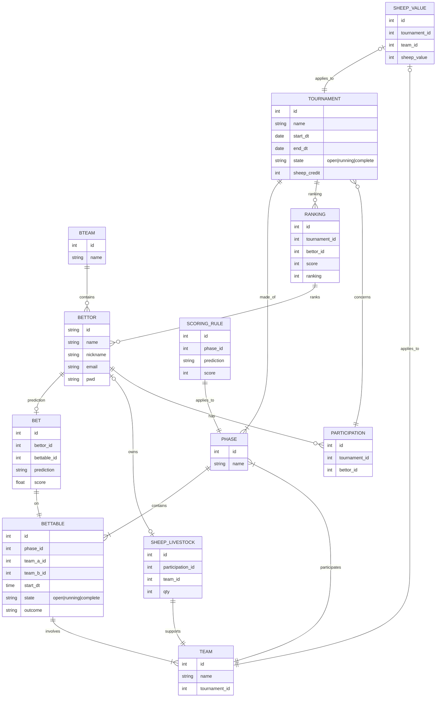

# Hello, this is Betty...

Betty aims to be a fun-based betting application. Fun-based in the sense that no money shall be involved between the participants, only sane competition and fun. 

The development is an opportunity for me to explore python, relational database and object-relational mapping. 

Caveat: The development is still at an early stage. I would not recommend to download this app at this stage as it may undergo major changes.

# Current State

10/06/2026 - Development ongoing...

# Basic concepts

The application allows to bet on **tournament** events. A tournament is limited in time and may consists in several phases, like for example the UEFA world cup 2026. In the latter case, **bettable** events would be match results. The **phase** would be the first round (played in pools), the second round (direct elimination), and the third round (final quarter, ie semi-final, final and consolation). The bet would concern the result of a match. A score is granted to the bettor depending on the bet vs the match result. 
**Scoring rules** may be specific to a tournament phase. 

As an example, in the first round of a football world cup, the bet **scoring rule** on a match between **teams** A and B may be : 
1) A wins, correct bet scoring 6 points
2) B wins, correct bet scoring 6 points
3) Draw, correct bet scoring 6 points
4) A wins or B wins, correct bet scoring 3 points
5) A wins or draw, correct bet scoring 3 points
6) B wins or draw, correct bet scoring 3 points

The **scoring rule** on the second round (direct elimination) would concern the result at the end of the official time, ie before the extra-time in case of a draw.

Each **bettable** event has a bet deadline. Eg 5 minutes before its start schedule. Bets on it can be made up to the deadline, never after.

The **tournament admin** sets-up the tournament, the phases and the bettables. This may be further completed as the tournament goes on.

**bettors** must first register to Betty in order to participate in a betting competition. 
Once registered, a **bettor** can register to one or more set-up tournament and enter its **bets** for the available tournament **bettables**

The **tournament admin** enters the **bettable** result. The bettor **ranking** for the tournament is computed according to the set up **scoring rules** (see above)

Teams of bettor (**bteam**) can be constituted by the **tournament admin** so that bettor team competition is possible too.

## Model diagram (mermaid)

